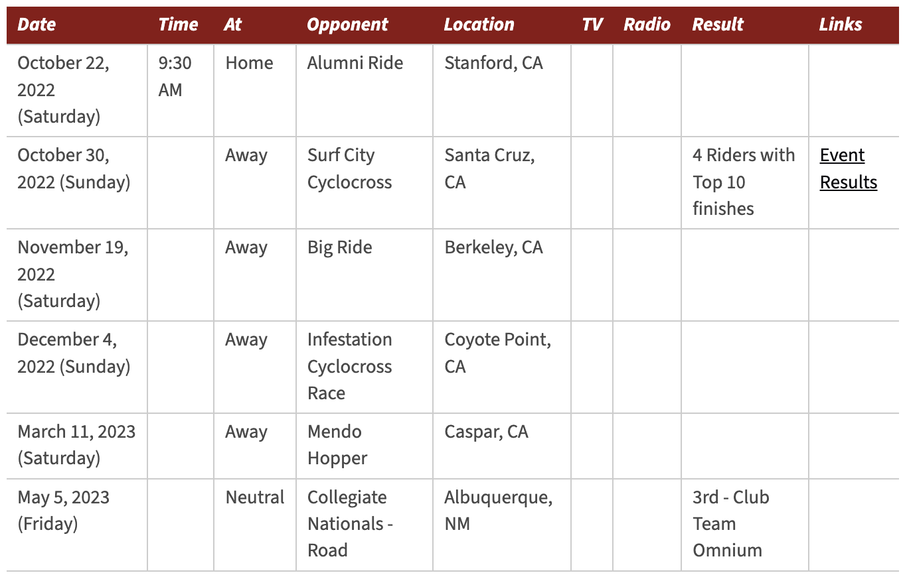

# pipe


<!-- WARNING: THIS FILE WAS AUTOGENERATED! DO NOT EDIT! -->

------------------------------------------------------------------------

<a
href="https://github.com/aliceheiman/clubsports/blob/main/clubsports/pipe.py#L29"
target="_blank" style="float:right; font-size:smaller">source</a>

### get_roster

>  get_roster (roster_url:str)

*Get a formatted Club Sports roster*

Let’s try out this function with the Stanford Cycling team.

``` python
roster_url = "https://stanfordclubsports.com/sports/cycling/roster/"
get_roster(roster_url)[0]
```

    {'title': 'Head Coach',
     'name': 'Adrian Bennett',
     'profile_url': 'https://stanfordclubsports.com/sports/cycling/roster/coaches/adrian-bennett/255'}

------------------------------------------------------------------------

<a
href="https://github.com/aliceheiman/clubsports/blob/main/clubsports/pipe.py#L53"
target="_blank" style="float:right; font-size:smaller">source</a>

### get_staff

>  get_staff (staff_url:str)

*Get and format Club Sport staff*

Let’s try this with the Stanford Cycling Team staff:

``` python
staff_url = "https://stanfordclubsports.com/sports/cycling/coaches"
get_staff(staff_url)[3]
```

    {'name': 'George Wehner',
     'profile_url': 'https://stanfordclubsports.com/sports/cycling/roster/staff/george-wehner/18',
     'title': 'President',
     'email_address': 'gtwehner@stanford.edu',
     'phone': ''}

------------------------------------------------------------------------

<a
href="https://github.com/aliceheiman/clubsports/blob/main/clubsports/pipe.py#L92"
target="_blank" style="float:right; font-size:smaller">source</a>

### get_academic_year

>  get_academic_year ()

*Helper to get the academic year*

``` python
get_academic_year()
```

    '2024-25'

------------------------------------------------------------------------

<a
href="https://github.com/aliceheiman/clubsports/blob/main/clubsports/pipe.py#L101"
target="_blank" style="float:right; font-size:smaller">source</a>

### get_schedule

>  get_schedule (schedule_url:str, season:str=None, naive=False)

*Get and parse a club sport schedule table.*

Let’s try this out for the cycling schedule 2022-2023 season. This is
the actual table from the Stanford Club Sports website:

<figure>

<figcaption aria-hidden="true">Stanford Cycling Season 2022-23
Schedule</figcaption>
</figure>

Now we fetch the schedule and display the second row:

``` python
schedule = get_schedule("https://stanfordclubsports.com/sports/cycling/schedule", "2022-23")
schedule[1]
```

    {'date': 'October 30, 2022 (Sunday)',
     'time': '',
     'at': 'Away',
     'opponent': 'Surf City Cyclocross',
     'location': 'Santa Cruz, CA',
     'tv': '',
     'radio': '',
     'result': '4 Riders with Top 10 finishes',
     'links': 'https://cyclo-x.com/results'}

Notice the `links` field. It actually fetched the link. If we want to
just get the cell contents, we can set `naive=True`.

``` python
schedule = get_schedule("https://stanfordclubsports.com/sports/cycling/schedule", "2022-23", naive=True)
schedule[1]["links"]
```

    'Event Results'

------------------------------------------------------------------------

<a
href="https://github.com/aliceheiman/clubsports/blob/main/clubsports/pipe.py#L157"
target="_blank" style="float:right; font-size:smaller">source</a>

### get_stories

>  get_stories (home_url:str)

*Get story blurbs from Club Sports website*

Let’s try with a few different teams, like Stanford Cycling and Women’s
Rugby.

``` python
home_url = "https://stanfordclubsports.com/sports/cycling"
get_stories(home_url)[:2]
```

    [{'title': '2025 USA Cycling Collegiate Road National Championships',
      'date': '2025-07-05T16:01:00',
      'story_url': 'https://stanfordclubsports.com/news/2025/7/5/2025-usa-cycling-collegiate-road-national-championships.aspx',
      'image_url': 'https://stanfordclubsports.com/images/2025/7/5/nationals.jpg',
      'teaser': 'May 2-4, 2025'}]

``` python
home_url = "https://stanfordclubsports.com/sports/womens-rugby"
get_stories(home_url)[:2]
```

    [{'title': "Stanford Women's Rugby Crowned CRAA Challenger 7s National Champions",
      'date': '2025-05-03T18:40:00',
      'story_url': 'https://stanfordclubsports.com/news/2025/5/3/stanford-womens-rugby-crowned-craa-challenger-7s-national-champions.aspx',
      'image_url': 'https://stanfordclubsports.com/images/2025/5/4/Natty_7s_SWR.jpeg',
      'teaser': 'May 3, 2025'},
     {'title': "Stanford Women's Rugby Advance to the Semi Finals in the CRAA 7s National Championship",
      'date': '2025-05-02T20:54:00',
      'story_url': 'https://stanfordclubsports.com/news/2025/5/2/stanford-womens-rugby-advance-to-the-semi-finals-in-the-craa-7s-national-championship.aspx',
      'image_url': 'https://stanfordclubsports.com/images/2025/4/5/0J5A4952_copy.jpg',
      'teaser': 'May 2, 2025'}]
